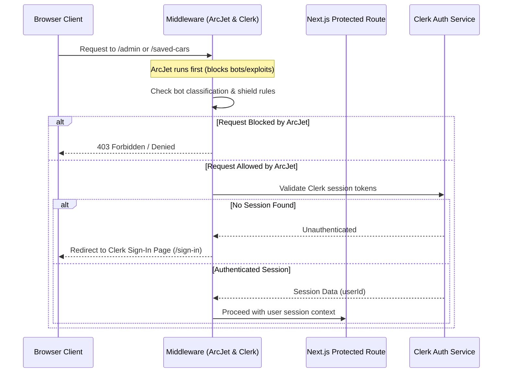

# AI Coding Agent Instructions & Reference (AGENTS.md)

Welcome, AI Coding Agent! This document provides the architectural reference, technology stack specifications, system constraints, development workflows, and repository rules for the **VehiQL** platform. Refer to this guide to ensure that any code changes, feature implementations, or refactoring tasks are fully aligned with the codebase's architecture and design patterns.

---

## 1. Project Overview
**VehiQL** is a production-grade, high-performance, AI-powered vehicle marketplace and vehicle intelligence platform. 

### Core Business Purpose:
*   **Intelligent Inventory Management:** Allow administrators to easily list and manage vehicle inventory.
*   **AI Spec Extraction:** Empower users and admins to upload vehicle photos and automatically extract key specifications (make, model, year, body type, transmission, fuel type, color, and a listing description) using Google Gemini AI.
*   **AI-Driven Search:** Offer a natural search experience, allowing users to upload a photo of a car they like to find matching or similar available models in the dealership inventory.
*   **Test Drive Scheduling:** Provide a seamless interface for users to book test drives based on live dealership working hours.

---

## 2. Tech Stack

### Frontend & UI
*   **Core Framework:** [Next.js 15.3.8 (App Router)](file:///c:/Deepyaman%20Mondal/vehiql2/package.json#L35)
*   **UI Engine:** React 19
*   **Styling:** Tailwind CSS v4 (using `@tailwindcss/postcss`)
*   **Component Libraries:** Radix UI primitives, configured via shadcn/ui components (`components/ui`)
*   **Icons:** Lucide React

### Backend & Middleware
*   **Server Framework:** Next.js Server Actions (`use server` modules inside the [actions/](file:///c:/Deepyaman%20Mondal/vehiql2/actions) folder)
*   **Security & Firewalls:** ArcJet WAF (`@arcjet/next`) handling shield protection, bot detection, and rate limiting
*   **Authentication:** Clerk (`@clerk/nextjs` Server SDK)

### Database Layer
*   **Engine:** PostgreSQL (hosted on Supabase)
*   **ORM:** Prisma Client (`@prisma/client` v6.8.2)
*   **Prisma Client Output:** Custom output directory configured to [lib/generated/prisma](file:///c:/Deepyaman%20Mondal/vehiql2/lib/generated/prisma)
*   **Connection Pooling:** PgBouncer (hosted on Supabase port 6543) for application queries; direct connection (Supabase port 5432) for migrations.

### Search Layer
*   **Current Search Engine:** Relies on PostgreSQL query matching via Prisma ORM (`contains` filters with `mode: "insensitive"`).
*   **Planned Search Engine:** Elasticsearch is proposed/designed as the future search layer for advanced text indexing and heavy query acceleration (not currently configured or active in the codebase).

### AI Layer
*   **SDK:** `@google/generative-ai`
*   **Model:** `gemini-2.5-flash`
*   **Use Cases:** 
    *   Vehicle spec extraction from uploaded images ([actions/cars.js](file:///c:/Deepyaman%20Mondal/vehiql2/actions/cars.js#L20))
    *   AI-driven image search parameter extraction ([actions/home.js](file:///c:/Deepyaman%20Mondal/vehiql2/actions/home.js#L48))

### DevOps & Infrastructure
*   **Containerization:** Multi-stage `Dockerfile` generating a standalone Next.js server bundle (`output: 'standalone'`).
*   **Development Env:** `Dockerfile.dev` with volume mounting and hot reloading.
*   **Orchestration:** Docker Compose (`docker-compose.yml`, `docker-compose.dev.yml`, and `docker-compose.prod.yml`).
*   **CI Pipeline:** Operational GitHub Actions workflow (`.github/workflows/ci.yml`) for linting, schema validation, standalone builds, and security scans.
*   **CD Pipeline:** Under active development and testing (`.github/workflows/cd.yml` and `scripts/deploy.sh`) for automated deployment to a target VPS.

---

## 3. Architecture

### Authentication Flow

*   **Clerk Session Gates:** Managed at the middleware level ([middleware.js](file:///c:/Deepyaman%20Mondal/vehiql2/middleware.js)). Protected routes include `/admin/*`, `/saved-cars/*`, and `/reservations/*`.
*   **Database User Syncing:** Handled inside Server Actions (e.g. resolving Clerk `userId` into database `User` records in `lib/checkUser.js` or directly via prisma queries).

### Database Layer
*   **Data Models:** PostgreSQL handles `User`, `Car` inventory, `DealershipInfo`, `WorkingHour` configurations, `UserSavedCar` relationships (wishlist), and `TestDriveBooking` items.
*   **Instance Resolver:** Managed by a singleton client definition in [lib/prisma.js](file:///c:/Deepyaman%20Mondal/vehiql2/lib/prisma.js) to prevent database connection exhaustion during development hot-reloads.
*   **Prisma Client:** Outputs client libraries to `lib/generated/prisma`. **Do not import directly from `@prisma/client`**; always import the DB client from `@/lib/prisma`.

### Search Layer
*   Search parameters (make, model, color, body type, fuel type, transmission, price range) are gathered via App Router URL parameters.
*   Server-side search queries are resolved inside [actions/car-listing..js](file:///c:/Deepyaman%20Mondal/vehiql2/actions/car-listing..js) using standard Prisma `findMany` queries.
*   *Note for AI Agents:* Do not attempt to call Elasticsearch APIs or import Elasticsearch clients as they are not currently configured.

### AI Layer
*   Uses Google Generative AI Node.js SDK to connect to `gemini-2.5-flash`.
*   Images uploaded from the frontend (represented as `File` objects or base64 data) are converted into base64 buffers and sent directly to Gemini with strict prompt instructions.
*   Gemini is instructed to output a raw JSON structure matching predefined schemas. The backend parses and validates these responses before returning them to the client or committing them to the database.

### Deployment Architecture
*   **Standalone Build:** The Next.js configuration is set to standalone output (`output: 'standalone'`). This compiles a minimal server bundle containing only the code and dependencies required to execute in production, reducing container sizes under 150MB.
*   **Docker Compose:** Development and Production environments are managed via Compose.
*   **Auto-Rollback Strategy:** The CD shell script ([scripts/deploy.sh](file:///c:/Deepyaman%20Mondal/vehiql2/scripts/deploy.sh)) checks the health of the container post-deployment. If it times out or fails HTTP validation, the script automatically rolls back to the previously active docker image tag.

---

## 4. Repository Rules

1.  **Preserve Clerk Authentication:** Never disable or bypass Clerk middleware in [middleware.js](file:///c:/Deepyaman%20Mondal/vehiql2/middleware.js) or actions. Always verify permissions by checking the `auth()` helper.
2.  **Preserve Prisma Client Path:** Keep the output of Prisma client targeted to `../lib/generated/prisma` inside `prisma/schema.prisma`. Ensure all imports load database operations from `@/lib/prisma`.
3.  **Do Not Modify Database Schema Without Approval:** Changing `prisma/schema.prisma` requires human engineering review. If schema changes are approved, run `npx prisma generate` to refresh local types, and prepare migrations using `npx prisma migrate dev`.
4.  **Maintain CI/CD Compatibility:** Keep dependencies clean. Do not add arbitrary node packages that fail standard compilations or trigger high/critical vulnerability alerts in security scans (Trivy).
5.  **Follow Existing Component Patterns:** Reusable components reside in the [components/](file:///c:/Deepyaman%20Mondal/vehiql2/components) folder. Atomic UI components belong to [components/ui/](file:///c:/Deepyaman%20Mondal/vehiql2/components/ui). Maintain Tailwind CSS v4 styling rules and do not introduce Tailwind v3 configurations.
6.  **Prefer Minimal Changes:** Write clean, focused code. Avoid large-scale refactorings of fully functional files unless specifically instructed. Ensure that all existing comments and JSDoc strings are preserved.

---

## 5. Development Workflow

### Branch Strategy
*   `main`: The primary integration branch. All code in `main` must pass CI checks.
*   `feature/*`: Feature development branch name prefix (e.g., `feature/analytics-dashboard`).
*   `fix/*` / `hotfix/*`: Bug fix branch names (e.g., `fix/booking-tz-offset`).
*   `docs/*`: Documentation changes (e.g., `docs/add-api-endpoints`).
*   `chore/*`: General maintenance tasks.

### Commit Conventions
Follow the Conventional Commits specification. Prefixes must reflect the change type:
*   `feat`: A new feature (e.g., `feat: integrate image removal in car edit form`)
*   `fix`: A bug fix (e.g., `fix: catch zero-byte image uploads in Gemini helper`)
*   `docs`: Documentation only changes (e.g., `docs: generate agent instructions`)
*   `style`: Code style modifications (formatting, white-space, semicolon additions)
*   `refactor`: Code changes that neither fix bugs nor add features
*   `test`: Adding missing tests or correcting existing ones
*   `chore`: Updating package dependencies, configurations, etc.
*   `ci`: Changes to CI/CD workflows and deployment configurations

### Build Validation Requirements
Prior to submitting any pull requests, run these local checks to ensure the pipeline will not fail:
```bash
# 1. Verify Prisma Schema syntax and relations
npx prisma validate

# 2. Compile Prisma Client types
npx prisma generate

# 3. Verify linting and ESLint configuration
npm run lint

# 4. Verify production compilation and standalone build
npm run build
```

---

## 6. AI-Assisted Development Guidelines

*   **Workflow:** This project utilizes an AI-assisted development workflow. You are encouraged to propose optimizations, write robust tests, and implement cleaner code.
*   **Validation:** Always run build and lint checks locally on the terminal before declaring tasks complete.
*   **Human Review Requirements:**
    *   *Architecture Decisions:* Modifying middleware logic, changing database layout, or introducing major server action structures.
    *   *Security & Authentication:* Altering Clerk settings, editing ArcJet WAF properties, or modifying CORS/Next.js headers.
    *   *Deployment Configuration:* Modifying `Dockerfile`, altering docker-compose files, or changing `.github/workflows` pipelines.
    *   *Production Readiness:* Any change that affects performance, database indices, or introduces unvetted npm packages.
